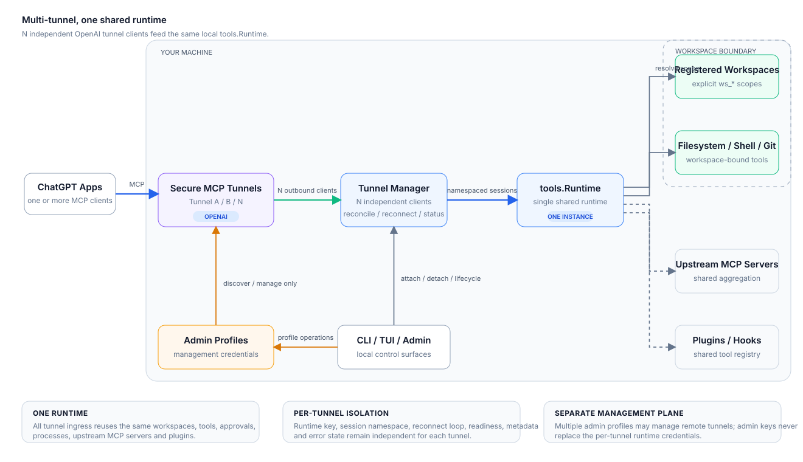

<div align="center">

# chatgpt-mcp

**A secure, workspace-bound bridge between ChatGPT and your machine.**

Single Go binary · OpenAI Secure MCP Tunnel · Linux, macOS, and Windows

[](https://github.com/mewisme/chatgpt-mcp/releases/latest)
[](https://github.com/mewisme/chatgpt-mcp/actions/workflows/ci.yml)
[](go.mod)
[](LICENSE)

[Get started](docs/getting-started.md) · [Connect ChatGPT](docs/openai-chatgpt.md) · [Command Center](docs/tui.md) · [Plugins](docs/plugins.md) · [Security](docs/security.md) · [Documentation](docs/README.md)

</div>

`chatgpt-mcp` lets ChatGPT work with local projects through explicitly registered workspaces. The default setup uses **OpenAI Secure MCP Tunnel**, so the runtime can stay private without exposing an inbound MCP port to the public internet.

## Overview

<p align="center">
  
</p>

The main path is intentionally small: ChatGPT reaches the local runtime through the Secure MCP Tunnel, then `chatgpt-mcp` applies workspace scope before filesystem, shell, Git, process, or upstream MCP work happens.

### Why chatgpt-mcp

- **Private by default for ChatGPT** — the Secure MCP Tunnel is outbound-only from your machine; public MCP ingress is not required.
- **Workspace-bound access** — filesystem, shell, Git, process, context, memory, rules, skills, and checkpoints operate against explicit `ws_*` workspace targets.
- **Local control stays local** — use the CLI, full-screen TUI, or embedded Admin UI to inspect and operate the runtime.
- **MCP aggregation** — optionally expose tools from upstream MCP servers through the same runtime.
- **One cross-platform binary** — native releases for Linux, macOS, and Windows on amd64 and arm64, with managed background-service support.

## Install

### Linux / macOS

```bash
curl -fsSL get.mewis.me/chatgpt-mcp.sh | sh
```

### Windows PowerShell

```powershell
irm https://get.mewis.me/chatgpt-mcp.ps1 | iex
```

### Homebrew

```bash
brew tap mewisme/mew
brew install --cask chatgpt-mcp
```

### Scoop

```powershell
scoop bucket add mew https://github.com/mewisme/scoop-mew
scoop install mew/chatgpt-mcp
```

Both `chatgpt-mcp` and the shorter `cgm` command are installed. The examples below use `cgm`.

## 5-minute setup

### 1. Initialize

```bash
cgm init
```

### 2. Register the project ChatGPT may work with

```bash
cgm workspace register ~/projects/my-project
```

The command returns a stable `ws_*` workspace ID. Register only roots you intentionally want the runtime to reach.

### 3. Attach the Secure MCP Tunnel

Create a tunnel and a restricted runtime API key in OpenAI Platform, then add/verify a management profile and attach the tunnel locally:

```bash
cgm tunnel admin add personal --admin-key 'sk-admin-...' --organization-id org_...
cgm tunnel admin verify personal
cgm tunnel attach tunnel_... --admin personal --runtime-api-key 'sk-...'
```

The runtime key should have **Tunnels Read + Use**. It is separate from the management profile's Admin API key and is not used to call a language model. Additional tunnels can be attached to the same local runtime without replacing the first one.

### 4. Start the managed runtime

```bash
cgm up
```

Verify locally:

```bash
cgm status
cgm tunnel status
```

### 5. Connect ChatGPT

Enable Developer Mode in ChatGPT, create a custom app using **Tunnel**, select the same tunnel, and **Scan Tools**.

The complete Platform permissions and ChatGPT setup flow is in [Connect ChatGPT with OpenAI Secure MCP Tunnel](docs/openai-chatgpt.md).

## Operate it

For interactive administration:

```bash
cgm tui
```

For scripts and automation, use the normal CLI:

```bash
cgm status
cgm workspace list
cgm logs -f
cgm config verify
```

Use `cgm <command> --help` for the live command surface. The exhaustive command inventory lives in the [CLI reference](docs/cli-reference.md), not in this README.

## Other MCP clients

The tunnel-first flow above is the default ChatGPT setup. Generic local MCP clients can instead use dedicated `stdio` or local Streamable HTTP transports:

```bash
cgm mcp stdio --workspace ~/projects/my-project
cgm mcp http --workspace ws_...
```

See [MCP clients and upstream servers](docs/mcp.md).

## Security model

`chatgpt-mcp` provides an application-level workspace and control-plane boundary, not a kernel sandbox. Paths are canonicalized, symlink escapes are rejected, trusted control-plane mutations are separated from ordinary workspace operations, and sensitive managed credentials are not stored as plaintext structured config.

Authentication uses three independent credentials: the **Admin token** for Admin API/UI, the **Direct MCP HTTP token** for local `/mcp` only (reusable across ChatGPT configurations, stored encrypted and revealable), and **tunnel runtime/admin keys** for OpenAI Secure MCP Tunnel. Direct MCP HTTP authentication does not apply to tunnel traffic.

If you need isolation from deliberately hostile native code running as the same OS user, use an OS sandbox, container/VM, or separate operating-system identity.

Read [Security](docs/security.md) before widening network exposure or filesystem access.

## Documentation

| Goal | Read |
| --- | --- |
| Install and connect ChatGPT | [Getting started](docs/getting-started.md) |
| Configure OpenAI Secure MCP Tunnel and the ChatGPT app | [OpenAI + ChatGPT](docs/openai-chatgpt.md) |
| Understand workspace scope and containers | [Workspaces](docs/workspaces.md) |
| Run, stop, inspect, update, and read logs | [Runtime and operations](docs/runtime.md) |
| Use the full-screen terminal UI | [TUI Command Center](docs/tui.md) |
| Configure auth, exposure, storage, and runtime settings | [Configuration](docs/configuration.md) |
| Connect generic clients or upstream MCP servers | [MCP and upstreams](docs/mcp.md) |
| Install, author, verify, update, or recover plugins | [Plugins](docs/plugins.md) |
| Look up commands and flags | [CLI reference](docs/cli-reference.md) |
| Understand trust boundaries | [Security](docs/security.md) |
| Diagnose common failures | [Troubleshooting](docs/troubleshooting.md) |
| Build and contribute | [Development](docs/development.md) |

See the [documentation index](docs/README.md) for the recommended reading paths.

## Development

Source builds require Go 1.27+, Node.js 24+, and pnpm 11+.

```bash
./scripts/check.sh
```

See [Development](docs/development.md) for the complete verification, CI, and release workflow, and [CONTRIBUTING.md](CONTRIBUTING.md) for contribution expectations.

## License

Copyright 2026 Nguyễn Mậu Minh. Licensed under the [Apache License, Version 2.0](LICENSE).

Third-party and adapted material keeps its original license. See [NOTICE](NOTICE), `third_party/`, `plugins/cf-tunnel/internal/cloudflared/LICENSE`, and `plugins/bash/licenses/`. Official CGM plugins declare SPDX `license` in `plugin.json` (Apache-2.0 except the bash payload, which is GPL-2.0-only). Community plugins choose their own SPDX expression; the field is metadata only.

"Caveman" is a trademark of Julius Brussee; this project uses the name only to attribute the MIT-licensed upstream material. See `third_party/caveman/NOTICE.md`.
